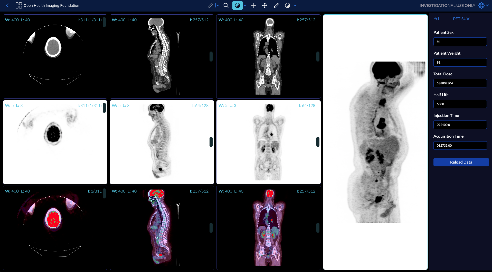

# Total Metabolic Tumor Volume

## Introduction

Total Metabolic Tumor Volume (TMTV) workflow mode enables quantitatively measurement of a tumor volume in a patient's body.
This mode is accessible in any study that has a PT and CT image series as you can see below

Note: If the study does not have a PT and CT image series, the TMTV workflow mode will not be available
and will become grayed out.

## Layout
The designed layout for the viewports follows a predefined hanging protocol which will place
10 viewports containing CT, PT, Fusion and Maximum Intensity Projection (MIP) PT scenes.

The hanging protocol will match the CT and PT displaySets based on series description. In terms
of PT displaySets, the hanging protocol will match the PT displaySet that has attenuated
corrected PET image data.

As seen in the image below, the first row contains CT volume in 3 different views of Axial,
Sagittal and Coronal. The second row contains PT volume in the same views as the first row.
The last row contains the fusion volume and the viewport to the right is a MIP of the PT
Volume in the Sagittal view.

## Synchronization

The viewports in the 3 rows are synchronized both for the Camera and WindowLevel.
It means that when you interact with the CT viewport (pan, zoom, scroll),
the PT and Fusion viewports will be synchronized to the same view. In addition
to camera synchronization, the window level of the CT viewport will be synchronized
with the fusion viewport.

### MIP
The tools that are activated on each viewport is unique to its data. For instance,
the mouse scroll tool for PT, CT and Fusion viewports are scrolling through the image data
(in different directions); however, the mouse scroll tool for the MIP viewport will
rotate the camera to match the usecase for the MIP.

## Panels
There are two panels that are available in the TMTV workflow mode and we will
discuss them in detail below.

### SUV Panel
This panel shows the PT metadata derived from the matched PT displaySet. The user
can edit/change the metadata if needed, and by reloading the data the new
metadata will be applied to the PT volume.

## ROI Threshold Panel
The ROI Threshold panel is a panel that allows the user to use the `RectangleROIStartEnd`
tool from Cornerstone to define and edit a region of interest. Then, the user can
apply a threshold to the pixels in the ROI and save the result as a segmentation volume.

By applying each threshold to the ROI, the Total Metabolic Tumor Volume (TMTV), and
the SUV Peak values will get calculated for the labelmap segments and shown in the
panel.

## Export Report

Finally, the results can be saved in the CSV format. The RectangleROI annotations
can also be extracted as a dicom RT Structure Set and saved as a DICOM file.

## Video Tutorial

Below you can see a video tutorial on how to use the TMTV workflow mode.
