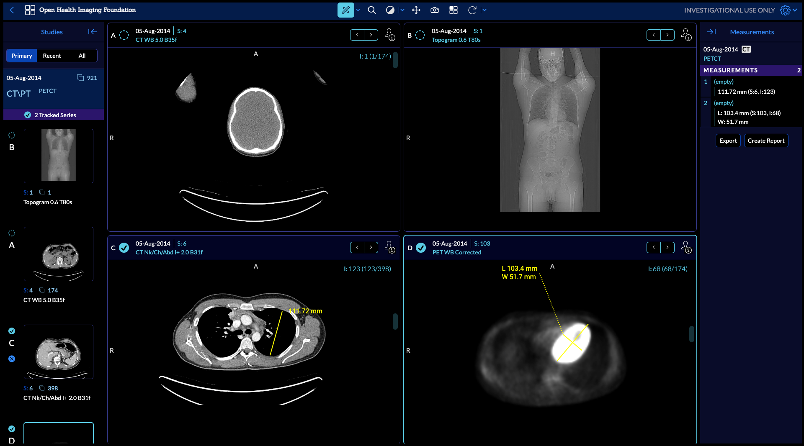

<a style={{marginRight:'10px'}} href="http://viewer.ohif.org/">Preview The OHIF Viewer</a>
<a href="https://www.netlify.com"/>
  

> ATTENTION! You are looking at the docs for the `OHIF-v3` Viewer (third time is
> always a charm). If you're looking for the our `OHIF-v2` (React stable
> version) or OHIF-v1 (deprecated `Meteor` version) select it's version from the
> dropdown box in the top left corner of this page.

The [Open Health Imaging Foundation][ohif-org] (OHIF) Viewer is an open source,
web-based, medical imaging viewer. It can be configured to connect to Image
Archives that support [DicomWeb][dicom-web], and offers support for mapping to
proprietary API formats. OHIF maintained extensions add support for viewing,
annotating, and reporting on DICOM images in 2D (slices) and 3D (volumes).

<!-- 
<i>The <strong>OHIF Viewer v3</strong>: A general purpose DICOM Viewer (<a href="http://viewer.ohif.org/">Live Demo</a>)
 -->

&nbsp;

## What's new in `OHIF-v3`

`OHIF-v3` is our second try for a React-based viewer, and is the third version
of our medical image web viewers from the start. The summary of changes include:

- Addition of workflow modes
  - Often, medical imaging use cases involves lots of specific workflows that
    re-use functionalities. We have added the capability of workflow modes, that
    enable people to customize user interface and configure application for
    specific workflow.
  - The idea is to re-use the functionalities that extensions provide and create
    a workflow. Brain segmentation workflow is different from prostate
    segmentation in UI for sure; however, they share the segmentation tools that
    can be re-used.
  - Our vision is that technical people focus of developing extensions which
    provides core functionalities, and experts to build modes by picking the
    appropriate functionalities from each extension.

* Redux store has been removed from the viewer, and a cleaner, more powerful
* Tailwind CSS
* End-to-end test suite

Below, you can find the gap analysis between the `OHIF-v2` and `OHIF-v3`:

<table>
    <thead>
        <tr>
            <th align="left" width="50%">OHIF-v2 functionalities</th>
            <th align="center">OHIF-v3</th>
            <th align="center">Comment</th>
        </tr>
    </thead>
<tbody>
    <tr>
        <td align="left">Rendering of 2D images via Cornerstone</td>
        <td align="center">✅</td>
        <td align="center"></td>
    </tr>
    <tr>
        <td align="left">Study List</td>
        <td align="center">✅</td>
        <td align="center"></td>
    </tr>
    <tr>
        <td align="left">Series Browser</td>
        <td align="center">✅</td>
        <td align="center"></td>
    </tr>
    <tr>
        <td align="left">DICOM JSON</td>
        <td align="center">✅</td>
        <td align="center"></td>
    </tr>
    <tr>
        <td align="left">2D Tools via CornerstoneTools</td>
        <td align="center">✅</td>
        <td align="center"></td>
    </tr>
    <tr>
        <td align="left">OpenID Connect standard authentication flow for connecting to identity providers</td>
        <td align="center">✅</td>
        <td align="center"></td>
    </tr>
    <tr>
        <td align="left">Internationalization</td>
        <td align="center">✅</td>
        <td align="center"></td>
    </tr>
    <tr>
        <td align="left">Drag/drop DICOM data into the viewer (see https://viewer.ohif.org/local)</td>
        <td align="center">✅</td>
        <td align="center"></td>
    </tr>
    <tr>
        <td align="left">White-labelling: Easily replace the OHIF Logo with your logo</td>
        <td align="center">✅</td>
        <td align="center"></td>
    </tr>
    <tr>
        <td align="left">DICOM Whole-slide imaging viewport</td>
        <td align="center">🔜</td>
        <td align="center">In Progress</td>
    </tr>
    <tr>
        <td align="left">IHE Invoke Image Display - Standard-compliant launching of the viewer (e.g. from PACS or RIS)</td>
        <td align="center">🔜</td>
        <td align="center">Not Started</td>
    </tr>
    <tr>
        <td align="left">DICOM PDF support</td>
        <td align="center">🔜</td>
        <td align="center">Not Started</td>
    </tr>
    <tr>
        <td align="left">Displaying non-renderable DICOM as HTML</td>
        <td align="center">🔜</td>
        <td align="center">Not Started</td>
    </tr>
    <tr>
        <td align="left">Segmentation support</td>
        <td align="center">🔜</td>
        <td align="center">Not Started</td>
    </tr>
    <tr>
        <td align="left">RT STRUCT support</td>
        <td align="center">🔜</td>
        <td align="center">Not Started</td>
    </tr>
    <tr>
        <td align="left">DICOM upload to PACS</td>
        <td align="center">🔜</td>
        <td align="center">Not Started</td>
    </tr>
    <tr>
        <td align="left">Google Cloud adapter</td>
        <td align="center">🔜</td>
        <td align="center">Not Started</td>
    </tr>
    <tr>
        <td align="left">VTK Extension + MIP / MPR layout</td>
        <td align="center">❌</td>
        <td align="center">Other plans that involves amazing news soon!</td>
    </tr>
    <tr>
        <td align="left">UMD Build (Embedded Viewer). </td>
        <td align="center">❌</td>
        <td align="center">The problem is that this breaks a bunch of extensions that rely on third party scripts (e.g. VTK) which have their own web worker loaders.</td>
    </tr>
</tbody>
</table>

## Where to next?

The Open Health Imaging Foundation intends to provide a simple general purpose
DICOM Viewer which can be easily extended for specific uses. If you find
yourself unable to extend the viewer for your purposes, please reach out via our
[GitHub issues][gh-issues]. We are actively seeking feedback on ways to improve
our integration and extension points.

Check out these helpful links:

- Ready to dive into some code? Check out our
  [Getting Started Guide](./development/getting-started.md).
- We're an active, vibrant community.
  [Learn how you can be more involved.](./development/contributing.md)
- Feeling lost? Read our [help page](./help.md).

<!--
  Links
  -->

<!-- prettier-ignore-start -->
[ohif-org]: https://www.ohif.org
[ohif-demo]: http://viewer.ohif.org/
[dicom-web]: https://en.wikipedia.org/wiki/DICOMweb
[gh-issues]: https://github.com/OHIF/Viewers/issues
<!-- prettier-ignore-end -->
