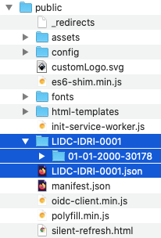
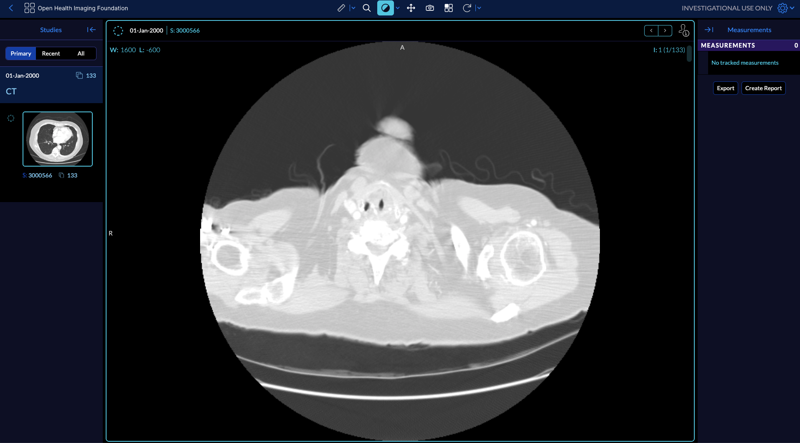

# DICOM JSON

You can launch the OHIF Viewer with a JSON file which points to a DICOMWeb
server as well as a list of study and series instance UIDs along with metadata.

An example would look like

`http://localhost:3000/myModeName/dicomjson?url=http://localhost:3000/LIDC-IDRI-0001.json`

As you can see the url to the location of the JSON file is passed in the query
after the `dicomjson` string, which is
`http://localhost:3000/LIDC-IDRI-0001.json` (in this case we have stored the
json file in the `public` directory of the `platform/viewer`).

## DICOM JSON sample

Here we are using the LIDC-IDRI-0001.json file which is a sample of the
LIDC-IDRI dataset (which is also stored in the `public` directory of the
`platform/viewer` for the purpose of this documentation). You can download the
LIDC-IDRI-0001.json files at the end of this guide.

Let's have a look at the JSON file:

### Metadata

JSON file stores the metadata for the study level, series level and instance
level. A JSON launch file should follow the same structure as the one below.

Note that at the instance level metadata we are storing both the `metadata` and
also the `url` for the dicom file on the dicom server. In this case we are
referring to
`dicomweb:http://localhost:3000/LIDC-IDRI-0001/01-01-2000-30178/3000566.000000-03192/1-001.dcm`
which is the `LIDC-IDRI-0001` in the `public` directory of the
`platform/viewer`.

```json
{
  "studies": [
    // first study metadata
    {
      "StudyInstanceUID": "1.3.6.1.4.1.14519.5.2.1.6279.6001.298806137288633453246975630178",
      "StudyDate": "20000101",
      "StudyTime": "",
      "PatientName": "",
      "PatientID": "LIDC-IDRI-0001",
      "AccessionNumber": "",
      "PatientAge": "",
      "PatientSex": "",
      "series": [
        // first series metadata
        {
          "SeriesInstanceUID": "1.3.6.1.4.1.14519.5.2.1.6279.6001.179049373636438705059720603192",
          "SeriesNumber": 3000566,
          "Modality": "CT",
          "SliceThickness": 2.5,
          "instances": [
            // first instance metadata
            {
              "metadata": {
                "Columns": 512,
                "Rows": 512,
                "InstanceNumber": 1,
                "SOPClassUID": "1.2.840.10008.5.1.4.1.1.2",
                "PhotometricInterpretation": "MONOCHROME2",
                "BitsAllocated": 16,
                "BitsStored": 16,
                "PixelRepresentation": 1,
                "SamplesPerPixel": 1,
                "PixelSpacing": [0.703125, 0.703125],
                "HighBit": 15,
                "ImageOrientationPatient": [1, 0, 0, 0, 1, 0],
                "ImagePositionPatient": [-166, -171.699997, -10],
                "FrameOfReferenceUID": "1.3.6.1.4.1.14519.5.2.1.6279.6001.229925374658226729607867499499",
                "ImageType": ["ORIGINAL", "PRIMARY", "AXIAL"],
                "Modality": "CT",
                "SOPInstanceUID": "1.3.6.1.4.1.14519.5.2.1.6279.6001.262721256650280657946440242654",
                "SeriesInstanceUID": "1.3.6.1.4.1.14519.5.2.1.6279.6001.179049373636438705059720603192",
                "StudyInstanceUID": "1.3.6.1.4.1.14519.5.2.1.6279.6001.298806137288633453246975630178",
                "WindowCenter": -600,
                "WindowWidth": 1600,
                "SeriesDate": "20000101"
              },
              "url": "dicomweb:http://localhost:3000/LIDC-IDRI-0001/01-01-2000-30178/3000566.000000-03192/1-001.dcm"
            },
            // second instance metadata
            {
              "metadata": {
                "Columns": 512,
                "Rows": 512,
                "InstanceNumber": 2,
                "SOPClassUID": "1.2.840.10008.5.1.4.1.1.2",
                "PhotometricInterpretation": "MONOCHROME2",
                "BitsAllocated": 16,
                "BitsStored": 16,
                "PixelRepresentation": 1,
                "SamplesPerPixel": 1,
                "PixelSpacing": [0.703125, 0.703125],
                "HighBit": 15,
                "ImageOrientationPatient": [1, 0, 0, 0, 1, 0],
                "ImagePositionPatient": [-166, -171.699997, -12.5],
                "FrameOfReferenceUID": "1.3.6.1.4.1.14519.5.2.1.6279.6001.229925374658226729607867499499",
                "ImageType": ["ORIGINAL", "PRIMARY", "AXIAL"],
                "Modality": "CT",
                "SOPInstanceUID": "1.3.6.1.4.1.14519.5.2.1.6279.6001.512235483218154065970649917292",
                "SeriesInstanceUID": "1.3.6.1.4.1.14519.5.2.1.6279.6001.179049373636438705059720603192",
                "StudyInstanceUID": "1.3.6.1.4.1.14519.5.2.1.6279.6001.298806137288633453246975630178",
                "WindowCenter": -600,
                "WindowWidth": 1600,
                "SeriesDate": "20000101"
              },
              "url": "dicomweb:http://localhost:3000/LIDC-IDRI-0001/01-01-2000-30178/3000566.000000-03192/1-002.dcm"
            }
            // ..... other instances metadata
          ]
        }
        // ... other series metadata
      ],
      "NumInstances": 133,
      "Modalities": "CT"
    }
    // second study metadata
  ]
}
```

### Demo

After you located the JSON file and the folder containing the dicom files inside
your `public` folder, you can navigate to
`http://localhost:3000/viewer/dicomjson?url=http://localhost:3000/LIDC-IDRI-0001.json`
which would load the viewer with the study that we have specified in the JSON
(don't forget `yarn install` and `yarn dev`). As seen in the image bellow, all
the instances (133) have been loaded.

Download JSON file from
[here](https://www.dropbox.com/sh/zvkv6mrhpdze67x/AADLGK46WuforD2LopP99gFXa?dl=0)

Sample DICOM files can be downloaded from
[TCIA](https://wiki.cancerimagingarchive.net/display/Public/LIDC-IDRI) or
directly from
[here](https://www.dropbox.com/sh/zvkv6mrhpdze67x/AADLGK46WuforD2LopP99gFXa?dl=0)

Your public folder should look like this:




