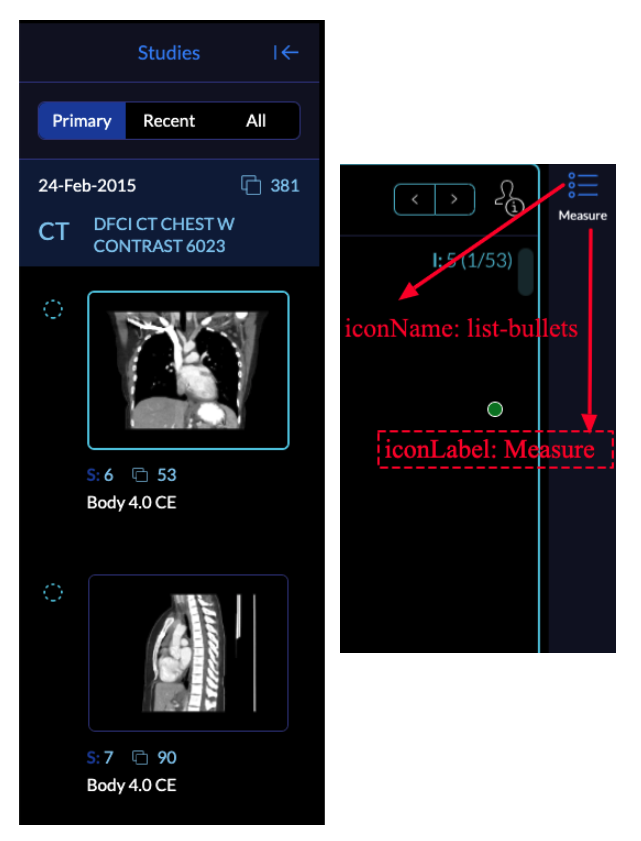

# Module: Panel

## Overview

The default LayoutTemplate has panels on the left and right sides, however one
could make a template with panels at the top or bottom and make extensions with
panels intended for such slots.

An extension can register a Panel Module by defining a `getPanelModule` method.
The panel module provides the ability to define `menuOptions` and `components`
that can be used by the consuming application. `components` are React Components
that can be displayed in the consuming application's "Panel" Component.



The `menuOptions`'s `target` key, points to a registered `components`'s `id`. A
`defaultContext` is applied to all `menuOption`s; however, each `menuOption` can
optionally provide it's own `context` value.

The `getPanelModule` receives an object containing the `ExtensionManager`'s
associated `ServicesManager` and `CommandsManager`.

```jsx
import PanelMeasurementTable from './PanelMeasurementTable.js';

function getPanelModule({
  commandsManager,
  extensionManager,
  servicesManager,
}) {
  const wrappedMeasurementPanel = () => {
    return (
      <PanelMeasurementTable
        commandsManager={commandsManager}
        servicesManager={servicesManager}
      />
    );
  };

  return [
    {
      name: 'measure',
      iconName: 'list-bullets',
      iconLabel: 'Measure',
      label: 'Measurements',
      isDisabled: studies => {}, // optional
      component: wrappedMeasurementPanel,
    },
  ];
}
```

## Consuming Panels Inside Modes

As explained earlier, extensions make the functionalities and components
available and `modes` utilize them to build an app. So, as seen above, we are
not actually defining which side the panel should be opened. Our extension is
providing the component with its.

New: You can easily add multiple panels to the left/right side of the viewer
using the mode configuration. As seen below, the `leftPanels` and `rightPanels`
accept an `Array` of the `IDs`.

```js
export default function mode({ modeConfiguration }) {
  return {
    id: 'viewer',
    routes: [
      {
        path: 'longitudinal',
        layoutTemplate: ({ location, servicesManager }) => {
          return {
            id,
            props: {
              leftPanels: [
                '@ohif/extension-measurement-tracking.panelModule.seriesList',
              ],
              rightPanels: [
                '@ohif/extension-measurement-tracking.panelModule.trackedMeasurements',
              ],
              viewports,
            },
          };
        },
      },
    ],
    extensions: [
      '@ohif/extension-default',
      '@ohif/extension-cornerstone',
      '@ohif/extension-measurement-tracking',
      '@ohif/extension-dicom-sr',
    ],
  };
}
```
