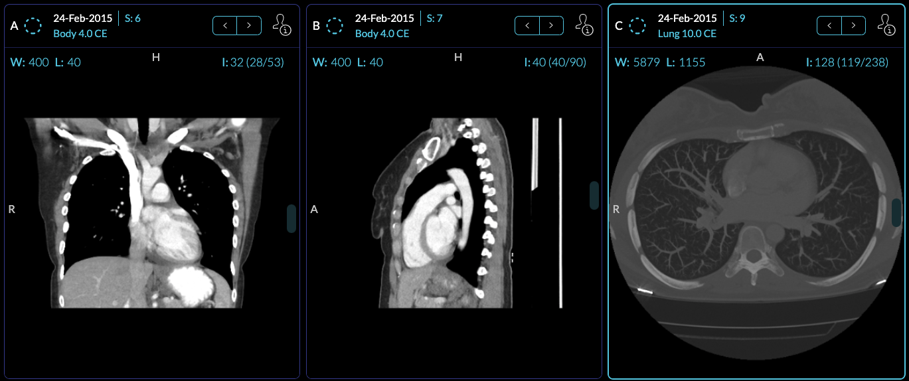

# Module: Viewport

## Overview

Viewports consume a displaySet and display/allow the user to interact with data.
An extension can register a Viewport Module by defining a `getViewportModule`
method that returns a React component. Currently, we use viewport components to
add support for:

- 2D Medical Image Viewing (cornerstone ext.)
- Structured Reports as SR (DICOM SR ext.)
- Encapsulated PDFs as PDFs (DICOM pdf ext.)

The general pattern is that a mode can define which `Viewport` to use for which
specific `SOPClassHandlerUID`, so if you want to fork just a single Viewport
component for a specialized mode, this is possible.

```jsx
// displaySet, viewportIndex, dataSource
const getViewportModule = () => {
  const wrappedViewport = props => {
    return (
      <ExampleViewport
        {...props}
        onEvent={data => {
          commandsManager.runCommand('commandName', data);
        }}
      />
    );
  };

  return [{ name: 'example', component: wrappedViewport }];
};
```

## Example Viewport Component

A simplified version of the tracked `OHIFCornerstone3DViewport` is shown below, which
creates a cornerstone3D viewport:

:::note Tip

Not in OHIF version 3.1 we use `displaySets` in the props which is new compared to
the previous version (3.0) which uses `displaySet`. This is due to the fact that
we are moving to a new data model that can render fused images in a single viewport.

:::

```jsx
function TrackedCornerstoneViewport({
  children,
  dataSource,
  displaySets,
  viewportIndex,
  servicesManager,
  extensionManager,
  commandsManager,
}) {

  return (
    <div className="viewport-wrapper">
      /** Resize Detector */
      <ReactResizeDetector
        handleWidth
        handleHeight
        skipOnMount={true} // Todo: make these configurable
        refreshMode={'debounce'}
        refreshRate={100}
        onResize={onResize}
        targetRef={elementRef.current}
      />
      /** Div For displaying image */
      <div
        className="cornerstone3D-viewport-element"
        style={{ height: '100%', width: '100%' }}
        onContextMenu={e => e.preventDefault()}
        onMouseDown={e => e.preventDefault()}
        ref={elementRef}
      ></div>
    </div>
  );
}
```


### `@ohif/viewer`

Viewport components are managed by the `ViewportGrid` Component. Which Viewport
component is used depends on:

- Hanging Protocols
- The Layout Configuration
- Registered SopClassHandlers



<center><i>An example of three cornerstone Viewports</i></center>
