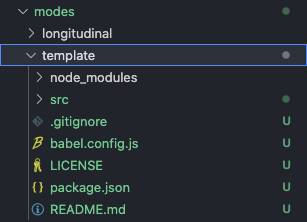
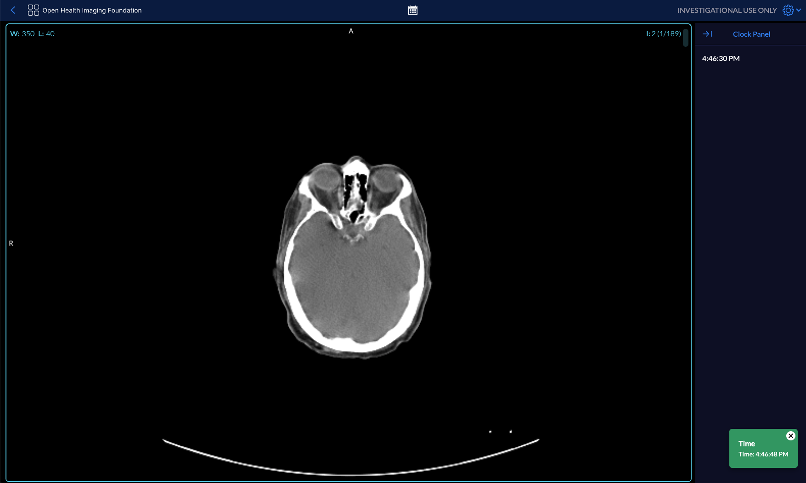

# Mode: Installation

OHIF-v3 provides the ability to utilize external modes and extensions. In this
document we will describe how to add/install external modes.

> Our long-term plan is to make OHIF-v3 capable of installing modes at runtime,
> however in the meantime, please use the instructions below to manually install
> modes and their extensions.

## Installing a Mode

### 1) Mode Files Copy

We use a [Template Mode](https://github.com/OHIF/mode-template) repository to
demonstrate how to install an external mode. This repository also includes all
the files required to create a new mode. You can use this repository as a
starting point to create your own mode.

As you can see in the Template mode
[code base](https://github.com/OHIF/mode-template), folders structure are
similar to the OHIF-maintained modes. Let's have more detailed look at the
structure of the `Template mode`:

- `src/index.js`: The most important file in any mode. This file is where modes'
  authors hav defined the mode configurations such as:
  - The layout and the panels for left and right side.
  - LifeCycle hooks such as `onModeEnter` and `onModeExit`
- Other files/folders/configs: .webpack, LICENSE, README.md, babel.config.js

Note: It is highly recommended to use the `Template Mode` as a starting point
for your own mode. This way, you can easily reuse the necessary files and
folders.

#### Package.json

Mode name is defined in the `package.json` file. The `package.json` file is a
JSON file that defines the mode name, version, and dependencies. For instance
for the Template mode, the `package.json` file looks like this:

```js {2} title="templateMode/package.json"
{
  "name": "@ohif/mode-template",
  "version": "0.0.1",
  "description": "A template mode for installation demonstration",
  ...
}
```

Note 1: We will use the `@ohif/mode-template` inside OHIF to let OHIF know about
existence of this mode.

Note 2: You don't need to use the `@ohif` scope for your modes/extensions. You
can use any scope you want or none at all.

Note 3: Although folders names are not important and the `package.json` file
contains the mode name, we recommend to use the same name for the folder name.



### 2) Configuring OHIF

In order to install/register the mode, we must make changes to a few areas
inside OHIF. The OHIF should be updated using the following lines of code:

#### Viewer's package.json

```js {6} titl="platform/viewer/package.json"
/* ... */
"dependencies": {
  /* ... */
  "@ohif/i18n": "^0.52.8",
  "@ohif/mode-longitudinal": "^0.0.1",
  "@ohif/mode-template": "^0.0.1",
  "@ohif/ui": "^2.0.0",
  "@types/react": "^16.0.0",
  /* ... */
}
```

#### App.jsx

```js {3} title="platform/viewer/src/App.jsx"
/* ... */
import '@ohif/mode-longitudinal';
import '@ohif/mode-template';
/* ... */
```

#### appInit.js

```js {4} title="platform/viewer/src/appInit.js"
/* ... */
if (!appConfig.modes.length) {
  appConfig.modes.push(window.longitudinalMode);
  appConfig.modes.push(window.templateMode);
}
/* ... */
```

Note that we are assigning mode configuration objects from the `window` object;
therefore, we should use the reference to the name of the mode which were
defined in the last line of `src/index.js` file in mode configuration

```js {8} title="templateMode/src/index.js"
/* ... */
export default function mode({ modeConfiguration }) {
  return {
    /** */
  };
}

window.templateMode = mode({});
```

### Required Extensions for a Mode

Some modes require external extensions to be installed. For instance, the
`@ohif/mode-longitudinal` mode requires the `@ohif/cornerstone` extension to be
registered/installed in OHIF which is available in the OHIF-v3 repository.

How do we know that a mode requires an extension? (Until we have a more proper
dependency management for modes and extensions) you can take a look inside the
mode itself. Mode is a configuration file that defines the layout
(layoutModule), panels (panelModule), viewport (viewportModule), and tools
(commands) that are used to create an application at a given route. By looking
inside the mode configuration file (`index.js`), you can see which extensions
are required by the mode in the `extensions` property.

```js {12-16} title="platform/viewer/src/appInit.js"
export default function mode({ modeConfiguration }) {
  return {
    id: 'template',
    displayName: 'Template Mode',
    /** ... */

    routes: [
      {
        /** ... */
      },
    ],
    extensions: [
      'extension.template',
      'org.ohif.default',
      'org.ohif.cornerstone',
    ],
    /** ... */
  };
}
```

As seen, our `Template Mode` requires the `org.ohif.default`,
`org.ohif.cornerstone` and `extension.template` extensions.

> Note: Currently extensions dependencies are not handled by OHIF from the
> `extensions` property. We will be adding this feature in the future.

In addition to the `extensions` property, the `mode` configuration object also
has the reference for each module that is used. For instance, the `index.js`
file in the `@ohif/mode-template` mode looks like this:

```js {10} title="clockMode/src/index.js"
// ....
routes: [
  {
    path: "template",
    layoutTemplate: ({ location, servicesManager }) => {
      return {
        id: ohif.layout,
        props: {
          leftPanels: [],
          rightPanels: ["extension.template.panelModule.clockPanel"],
          viewports: [
            {
              namespace: "org.ohif.cornerstone.viewportModule.cornerstone",
              displaySetsToDisplay: ["org.ohif.default.sopClassHandlerModule.stack"],
            },
          ],
        },
      };
    },
  },
],
// ....
```

As seen, the right panel is defined as
`"extension.template.panelModule.clockPanel"` which means that the
`@ohif/mode-template` mode requires the `extension.template`. You can read more
about installing extensions in the
[Extension Installation](../extensions/installation.md)

> Additionally you can check the commands that the toolbar buttons will execute
> in the `toolbarButtons` and see if any of them requires an extension.

After you installed the extension, you need to run `yarn install` in the root
folder of the OHIF repository to install the registered extension and modes.

Running `yarn dev` will then start the application with the installed mode.
Congrats! 🎉


