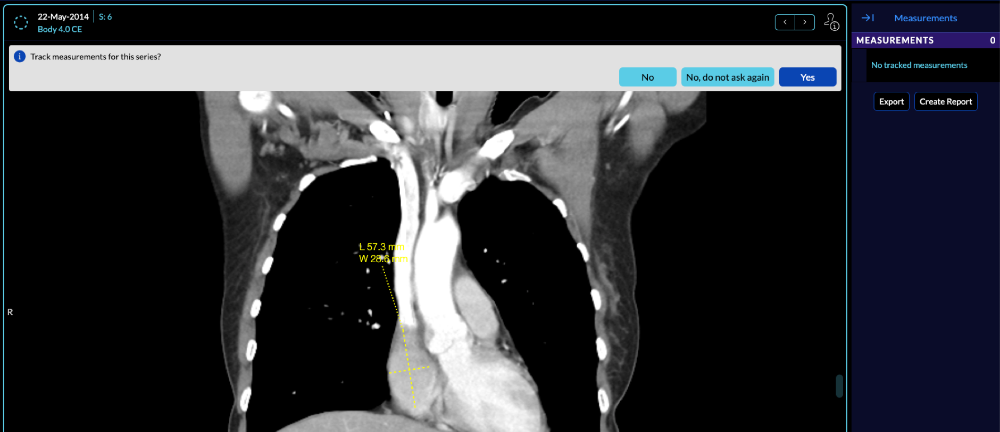
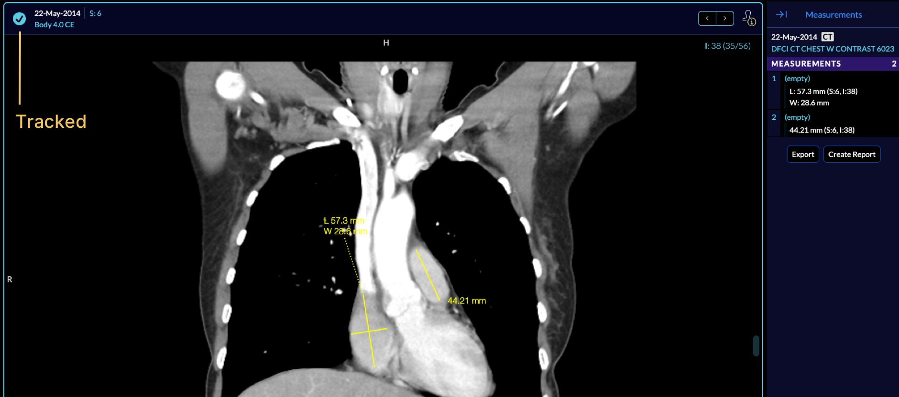
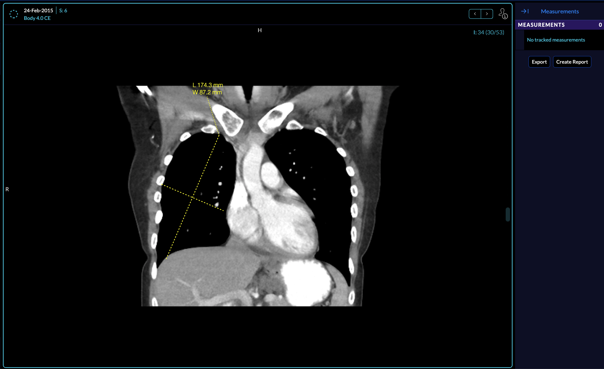
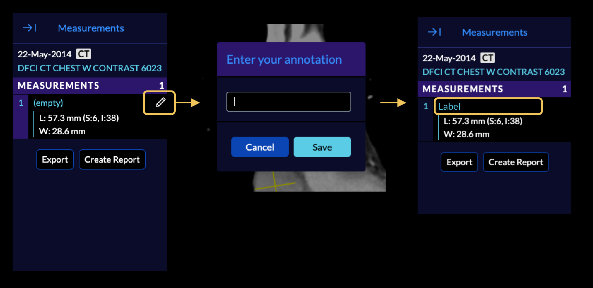

# Measurement Panel

## Introduction
In `Basic Viewer` mode, the right panel is the `Measurement Panel`. The Measurement Panel can be expanded or hidden by clicking on the arrow to the left of `Measurements`.
<!-- We might want to make an entire section about the tracking workflow including SR hydration because it's pretty complicated. Let's review after the deploy branch is ready. Logic is in OHIF-63 OHIF-339 tickets for reference -->
Select a measurement tool and mark an image to initiate measurement tracking. A pop up will ask if you want to track measurements for the series on which the annotation was drawn.

If you select `Yes`, the series becomes a `tracked series`, and the current drawn measurement and next measurements are shown on the measurement panel on the right.

If you select `No`, the measurement becomes temporary. The next annotation made will repeat the measurement tracking prompt.

If you select `No, do not ask again`, all annotations made on the study will be temporary.
<!-- Temporary measurement screenshot -->

## Labeling Measurements
You can edit the measurement name by hovering over the measurement and selecting the edit icon. You can also label or relabel a measurement by right-clicking on it in the viewport.

## Deleting a Measurement
A measurement can be deleting by dragging it outside the image in the viewport or by right-clicking on the measurement in the viewport and selecting 'Delete'.

## Jumping to a Measurement
Measurement navigation inside the top viewport can be used to move to previous and next measurement.

If a series containing a measurement is currently being displayed in a viewport, you can jump to display the measurement in the viewport by clicking on it in the Measurement Panel.

## Export Measurements
<!-- I think PDF and DICOM export didn't make it into this version but should be options. Let's confirm -->
You can export the measurements by clicking on the `Export`. A CSV file will get downloaded to your local computer containing the drawn measurements.

If you have set up your DICOM server to be able to store instances from the viewer, then you are able to create a report by clicking on the `Create Report`.
This will create a DICOM Structured Report (SR) from the measurements and push it
to the server.

For instance, running the Viewer on a local DCM4CHEE:

    <iframe src="https://player.vimeo.com/video/557569965?badge=0&amp;autopause=0&amp;player_id=0&amp;app_id=58479" frameBorder="0" allow="autoplay; fullscreen; picture-in-picture" allowFullScreen style= {{ position:"absolute",top:0,left:0,width:"100%",height:"100%"}} title="measurement-report"></iframe>

## Overview Video
An overview of measurement drawing and exporting can be seen below:

    <iframe src="https://player.vimeo.com/video/545986384?badge=0&amp;autopause=0&amp;player_id=0&amp;app_id=58479" frameBorder="0" allow="autoplay; fullscreen; picture-in-picture" allowFullScreen style= {{ position:"absolute",top:0,left:0,width:"100%",height:"100%"}} title="measurement-report"></iframe>

