# Installation on Windows
On Windows, the easiest way to install LesionTracker is using the provided Windows Installer. You can download the latest version of LesionTracker installer from [OHIF](ohif.org)

## Install

1. After you have obtained the latest version of LesionTracker installer, double-click the installer to install the application.
2. When you start the installer, setup wizard will pop up.

  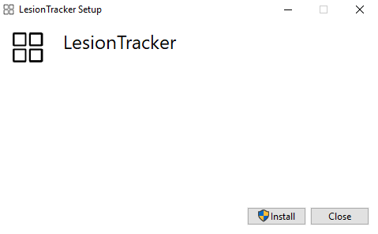

3. Click **Install** to start the installation.
4. LesionTracker will install prerequisites if they do not exist before installing the application.

  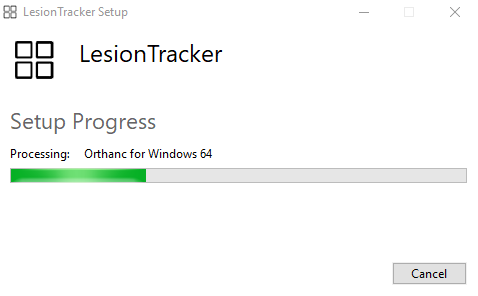

5. Click the **Next** if you accept the installation.

  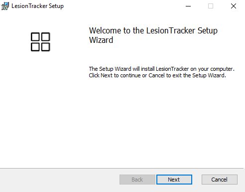

6. Read the license agreement, and if you agree, click **I accept the terms in the License Agreement** and then click the **Next**.

  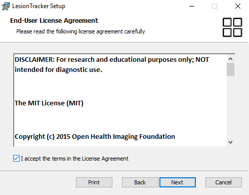

7. Select a location to install LesionTracker and click the **Next** to continue.

  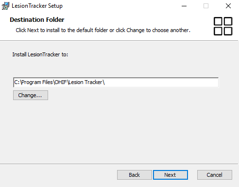

8. Click the **Install** to start the installation and the installation will be started.

  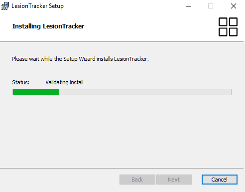

9. Click **Finish** to complete the installation.

  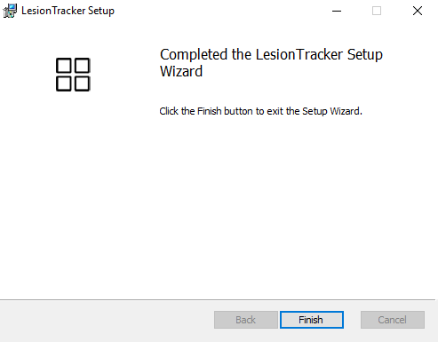

10. When the installation is done,
* You will see the final dialog which gives the URLs in order to connect to LesionTracker Viewer and Orthanc Server.

    * It will launch computer's default browser and display LesionTracker Viewer if you click 'http://localhost:3000'
    * It will launch computer's default browser and enables to upload studies to Orthanc Server if you click 'http://localhost:8042'

  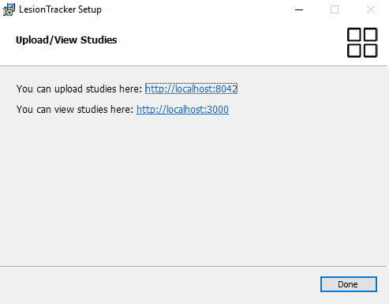

* Also, LesionTracker installer will create two shortcuts named LesionTracker and Orthanc Server on the Desktop.

    * It will launch computer's default browser and display LesionTracker image viewer if you click LesionTracker application on the Desktop.
    * It will launch computer's default browser and enables to upload studies to Orthanc Server if you click Orthanc Server application.

  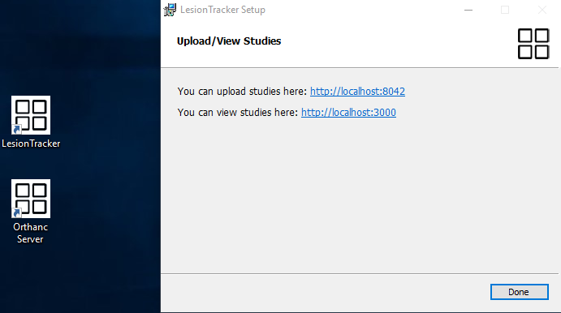

11. Click the **Done** and **Close** to close the installation window.

  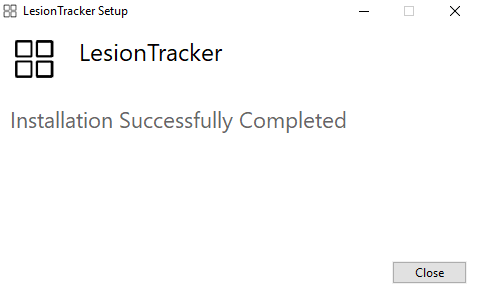

12. After the installation is completed,
* You can find the project folder in C:\Program Files\OHIF\LesionTracker if you use the default installation location.
* You will find 4 program executables which eases managing the services in the project folder:

    * **Start Services.exe:** Starts LesionTracker, MongoDB and Orthanc services manually.
    * **Stop Services.exe:** Stops LesionTracker, MongoDB and Orthanc services manually.
    * **Turn Off Auto Services.exe:** Configures not to start LesionTracker, MongoDB and Orthanc services automatically when Windows starts up.
    * **Turn On Auto Services.exe:** Configures to start LesionTracker, MongoDB and Orthanc services automatically when Windows starts up.

  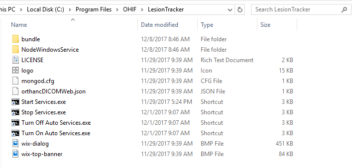

## Uninstall

1. Open the Start Menu.
2. Click **Settings**.
3. Click **Apps** on the Settings menu.
4. Select **Apps & features** from the left panel.
5. Find the LesionTracker in programs list and click LesionTracker, then click the **Uninstall**.

  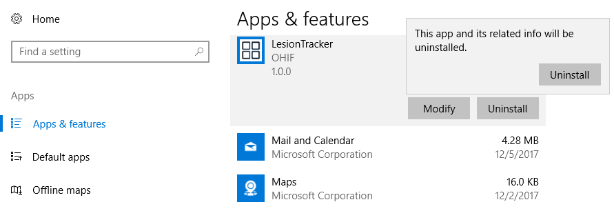

6. Click **Uninstall** from the LesionTracker Setup dialog.

  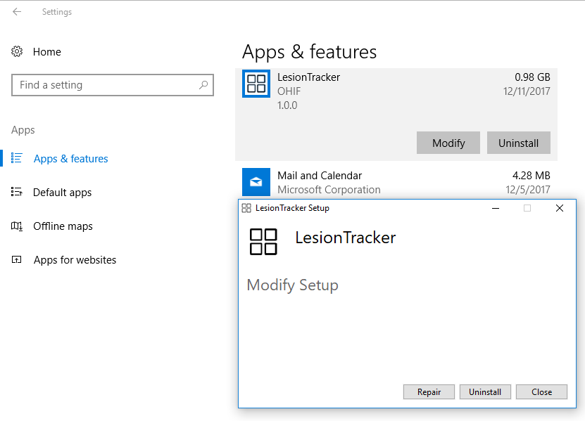

When the uninstallation is done, the uninstallation will remove;

* Prerequisites: MongoDB, nodejs and Orthanc Server
* The project folder, OHIF, from C:\Program Files
* Background Services: LesionTracker Server, MongoDB and Orthanc services
* Shortcuts: LesionTracker and Orthanc Server shortcuts on the Desktop
